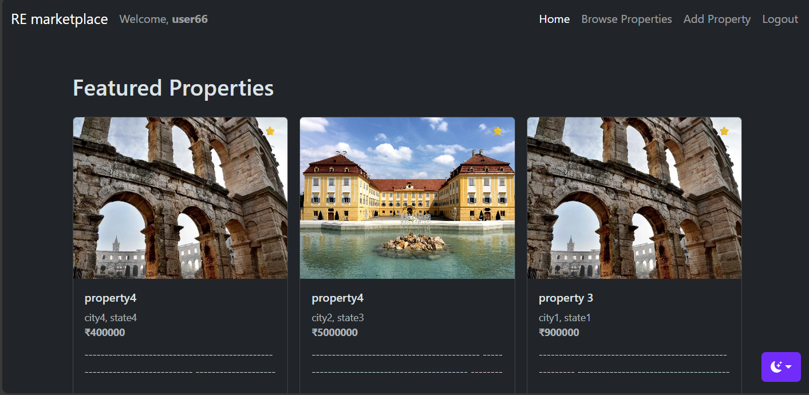

# Real Estate Market Place
RE-Market place is a centralized platform where Real Estate Agents can list properties for sale or rent, and potential Buyers can search, filter, and view these properties. 
The platform acts as a bridge, facilitating inquiries and lead generation for agents. 

RE-Market place web application was made using , [django](https://www.djangoproject.com/) - python based web-framework
- Front-end
    - Bootstrap 5, html , css , java script
- User Management and backend 
    - Django built-in function are used to manage users and handle backend
- Database : sqllite3
- [Pillow](https://pypi.org/project/pillow/): For resizing and saving images.
    
-----------

## **Installation**
### pre-requisites before installing
- Django == 5.2.8
- Pillow >= 10.0.0
- python-dotenv == 1.0.0

### **.env file configuration**
    # Django Settings
    SECRET_KEY=django-insecure-%eo-r619=npp_r-hhp+(6j)6o1_&cy9n+24f)7r0nmxqftz8pd
    DEBUG=True
    ALLOWED_HOSTS=localhost,127.0.0.1

    # Email Configuration (Gmail SMTP)
    EMAIL_BACKEND=django.core.mail.backends.smtp.EmailBackend
    EMAIL_HOST=smtp.gmail.com
    EMAIL_PORT=587
    EMAIL_USE_TLS=True
    EMAIL_HOST_USER="your-host-email-id"
    EMAIL_HOST_PASSWORD="your-email-host-pass"
    DEFAULT_FROM_EMAIL="default-email-id"

-----

### Git-repo --> [Link](https://github.com/purush0t/re_marketplace_webapp )
#### Clone git repo
```
git clone https://github.com/purush0t/re_marketplace_webapp 
cd project1
# to run project 
python manage.py runserver 

```
### File structure
```text
project1-root/
├── page1(app)/
│   ├── templates
│   |      ├─front-end files
│   ├── static
│   │      ├─assests
│   └── app setting py files
├── re_market(project-folder)
│   └──  project setting py 
├──.env
├──requirements.txt
└── manage.py
```


------
### Preview



### Usage and Key features
- **Login and Sign-up**
    - users can sign-up as users or realators, to list properties 

- **Filter section** to browse through all the listed properties

- **Add property section**, to add new properties to the listing, if you're signed up as a realator

- **Agent contact**, users can fill the agent contact from found on each property view-section to send an email-enquiry
    - realator also get a notification about the enquiry in the add property section


